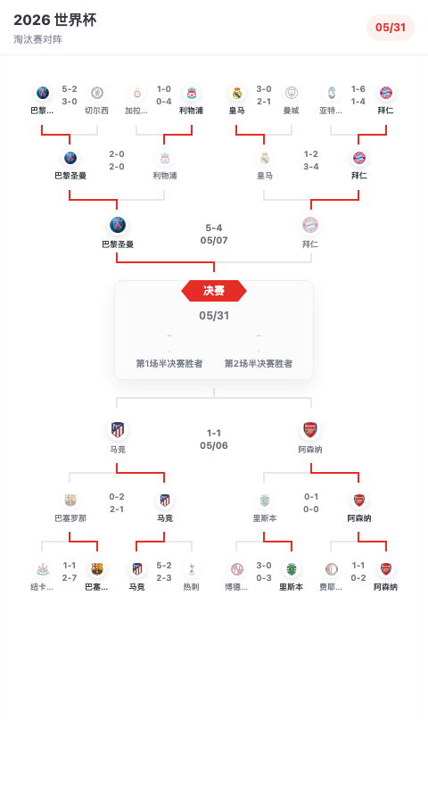

# MatchTree

Vue 3 足球淘汰赛对阵树源码组件，用于展示 16 强到决赛的杯赛晋级路径。组件已内置响应式等比缩放，窄屏下不会产生左右滚动，上下方向可正常滚动查看完整对阵图。

## 效果图




## 源码集成

把下面文件复制到目标项目中，建议保持目录结构不变：

```text
src/components/BracketMatch.vue
src/components/FinalCard.vue
src/components/MatchPickerModal.vue
src/components/TeamBadge.vue
src/components/TournamentBracket.vue
src/data/createBracketData.js
src/data/sampleBracketData.js
src/styles.css
```

如果希望统一从一个入口导入，也可以一并复制：

```text
src/index.js
```

目标项目需要已经安装 Vue 3。组件没有依赖额外 UI 库。

## 基础用法

假设组件复制到目标项目的 `src/vendor/match-tree/`：

```vue
<script setup>
import { TournamentBracket, createBracketData } from '@/vendor/match-tree';
import '@/vendor/match-tree/styles.css';

const bracketData = createBracketData();
</script>

<template>
  <TournamentBracket
    :data="bracketData"
    title="2026 世界杯"
    subtitle="淘汰赛对阵"
  />
</template>
```

也可以直接引用组件文件：

```vue
<script setup>
import TournamentBracket from '@/vendor/match-tree/components/TournamentBracket.vue';
import { createBracketData } from '@/vendor/match-tree/data/createBracketData';
import '@/vendor/match-tree/styles.css';

const bracketData = createBracketData();
</script>

<template>
  <TournamentBracket :data="bracketData" />
</template>
```

## 自定义数据

`data` 由 `teams`、`matches`、`finalMatch` 三部分组成。球队图标使用 `logo` 字段；如果没有传 `logo`，或者图片加载失败，组件会自动使用默认队徽。

```vue
<script setup>
import TournamentBracket from '@/vendor/match-tree/components/TournamentBracket.vue';
import '@/vendor/match-tree/styles.css';

const data = {
  teams: {
    home: {
      name: '主队',
      short: 'HOM',
      logo: 'https://example.com/home-logo.png',
    },
    away: {
      name: '客队',
      short: 'AWY',
      logo: 'https://example.com/away-logo.png',
    },
  },
  matches: [
    {
      id: 'top-1',
      phase: '上半区',
      round: '1/8 决赛',
      x: 5,
      y: 18,
      width: 96,
      teamIds: ['home', 'away'],
      scores: ['2-1', '1-1'],
      winnerId: 'home',
    },
  ],
  finalMatch: {
    id: 'final',
    date: '05/31',
    title: '决赛',
    homeLabel: '第1场半决赛胜者',
    awayLabel: '第2场半决赛胜者',
  },
};
</script>

<template>
  <TournamentBracket
    :data="data"
    title="2026 世界杯"
    subtitle="淘汰赛对阵"
    @select-match="(match) => console.log(match)"
  />
</template>
```

## Props

| 参数 | 类型 | 默认值 | 说明 |
| --- | --- | --- | --- |
| `data` | `Object` | 内置示例数据 | 完整对阵数据，包含 `teams`、`matches`、`finalMatch` |
| `teams` | `Object` | `null` | 单独覆盖球队字典 |
| `matches` | `Array` | `null` | 单独覆盖比赛节点列表 |
| `finalMatch` | `Object` | `null` | 单独覆盖决赛卡片 |
| `title` | `String` | `2026 世界杯` | 头部标题 |
| `subtitle` | `String` | `淘汰赛对阵` | 头部副标题 |
| `showHeader` | `Boolean` | `true` | 是否显示头部 |
| `interactive` | `Boolean` | `true` | 是否允许点击比赛节点 |
| `modalEnabled` | `Boolean` | `true` | 点击比赛节点后是否显示赛事选择弹窗 |
| `defaultTeamLogo` | `String` | 内置默认队徽 | 自定义默认队徽，支持图片 URL 或 data URL |

## 事件

| 事件 | 参数 | 说明 |
| --- | --- | --- |
| `select-match` | `match` | 点击比赛节点时触发 |

## 数据结构

### Team

```js
{
  name: '巴黎圣曼',
  short: 'PSG',
  logo: 'https://crests.football-data.org/524.png',
}
```

字段说明：

| 字段 | 类型 | 说明 |
| --- | --- | --- |
| `name` | `String` | 页面显示的球队名称 |
| `short` | `String` | 球队短名，可作为业务侧标识 |
| `logo` | `String` | 球队 logo 图片地址，可不传 |

### Match

```js
{
  id: 'top-1',
  phase: '上半区',
  round: '1/8 决赛',
  x: 5,
  y: 18,
  width: 96,
  teamIds: ['psg', 'chelsea'],
  scores: ['5-2', '3-0'],
  winnerId: 'psg',
  wideTeams: false,
  featured: false,
}
```

字段说明：

| 字段 | 类型 | 说明 |
| --- | --- | --- |
| `id` | `String` | 比赛唯一标识 |
| `phase` | `String` | `上半区` 或 `下半区`，决定连线方向 |
| `round` | `String` | 轮次描述，业务侧可用于统计或弹窗 |
| `x` | `Number` | 节点在对阵图中的横向位置 |
| `y` | `Number` | 节点在对阵图中的纵向位置 |
| `width` | `Number` | 节点宽度 |
| `teamIds` | `Array` | 两支球队在 `teams` 中的 key |
| `scores` | `Array` | 两行比分或日期文本 |
| `winnerId` | `String \| null` | 胜者球队 key；为空时不高亮胜者路径 |
| `wideTeams` | `Boolean` | 是否使用较宽的球队分布，适合 1/4 决赛节点 |
| `featured` | `Boolean` | 是否使用半决赛大节点样式 |

`x`、`y`、`width` 控制节点布局。当前组件主要面向固定 16 队淘汰赛，如果要支持 8 队、32 队或自动布局，建议先在业务侧生成对应节点坐标。

### FinalMatch

```js
{
  id: 'final',
  date: '05/31',
  title: '决赛',
  homeLabel: '第1场半决赛胜者',
  awayLabel: '第2场半决赛胜者',
}
```

## 响应式说明

对阵图内部按 `430px` 设计宽度排版。组件会根据容器宽度自动等比缩放：

- 宽屏下按原始尺寸展示
- 窄屏下整体缩小，不产生左右滚动
- 页面仍保留上下滚动，方便查看完整下半区
- 比赛节点、队徽、文字和连线一起缩放，位置比例保持一致

## 默认队徽

默认情况下，组件会使用内置 SVG 队徽作为兜底。你也可以通过 `defaultTeamLogo` 覆盖：

```vue
<TournamentBracket
  :data="bracketData"
  default-team-logo="/images/default-team-logo.png"
/>
```

当某支球队没有 `logo`，或 `logo` 加载失败时，会自动显示这个默认队徽。

## 关闭交互

如果只想展示静态对阵图，可以关闭交互：

```vue
<TournamentBracket
  :data="bracketData"
  :interactive="false"
/>
```

如果仍需要 `select-match` 事件，但不需要内置弹窗，可以只关闭弹窗：

```vue
<TournamentBracket
  :data="bracketData"
  :modal-enabled="false"
  @select-match="handleSelectMatch"
/>
```

## 导出内容

如果复制了 `src/index.js`，可以统一导入：

```js
import {
  TournamentBracket,
  createBracketData,
  sampleBracketData,
  teams,
  matches,
  finalMatch,
} from '@/vendor/match-tree';
```

`createBracketData()` 会返回一份内置示例数据的深拷贝，适合作为业务数据模板。

## 本地预览

```bash
npm install
npm run dev
```
